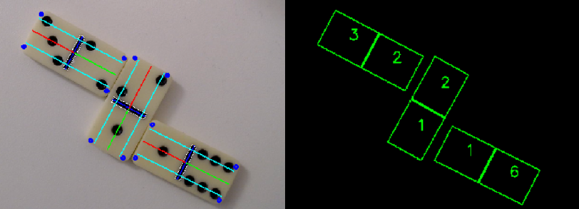

<figure>
</figure>

# domino-detection
This project is a final project of the Image Processing 2 module at Heilbronn University of Applied Science. The objective of this project is to recognize dominoes by means of classical image processing and, based on this, to check the correctness of the moves with the help of the game rules. For this purpose, the numbers of points of a domino as well as its orientation relative to adjacent dominoes are to be checked. If the numbers of points of two adjacent stones do not match according to the rules of the game, this should be recognized as a mistake.

# 1. Concept
To solve this problem, the special properties of the domino are to be exploited. Figure 1 shows three different dominoes from the game set as examples. When looking at the dominoes, the most striking feature is the distinctive separating bar in the middle of the domino. Thus, it is obvious to use this dividing line as a basis for machine vision. Based on this dividing line and the associated coordinates, all other reference points on the domino can then be clearly determined.

<figure>
    <figcaption align = "center"><b>Figure 1 - Sample Dominoes of the Game set</b></figcaption>
</figure>

Looking further at the present dominoes in Figure 1, a very helpful statement can likewise be made about the arrangement of the eyes on a domino. All eyes on the upper and lower halves lie on three axes perpendicular to the center line. Thereby, up to three eyes can be arranged on the outer axes and a maximum of one eye in the center on the middle axis. Using this knowledge, three detection lines are projected orthogonally to the center line.

<figure>
    <figcaption align = "center"><b>Figure 2 - Detection lines of a stone</b></figcaption>
</figure>

Corresponding eyes or their centers must therefore lie on one of these detection lines and can be counted.
and can be counted. In addition, a template pattern with a total of seven detection circles can be plotted for each side of the domino. The circles found on a detection line must lie within this pattern to be relevant in the evaluation.
to be relevant in the evaluation. The detection lines as well as the template pattern are shown again visually in Figure 2.

<figure>
    <figcaption align = "center"><b>Figure 3 - Detection lines of a stone</b></figcaption>
</figure>

Figure 3 shows the relevant points that can be approximated using the coordinates of the determined
line can be approximated. In addition to the edge coordinates of the domino, these also include the start coordinates of the detection lines and the centers of the two patterns.
of the two patterns. With the help of these center points and the mean detection line, the positional relationship between the dominoes by using the angle calculation of vector lines. vector lines, can be determined.

# 2. Developement Environment
In the context of this project a simple graphical development environment was developed, with the goal of optimizing and evaluating the required processing algorithms and processes via user controls in the form of sliders to optimize and evaluate the required processing algorithms and processes.

<figure>
    <figcaption align = "center"><b>Figure 4 - Adaptive Threshold Widget</b></figcaption>
</figure>

For each step of preprocessing, detection and processing, a single widget window was implemented. Figure 4 shows an example of the widget for the Adaptive Threshold. During program runtime, the parameters can be changed using the sliders, and the result is displayed directly in the output image. Each widget has the possibility to change the input image via a selection field

The individual widgets can be opened individually in the main window of the application by double-clicking
on the element in the list. In addition to the widget selection, the main window also displays the original camera image as shown in Figure 5.

<figure>
    <figcaption align = "center"><b>Figure 5 - Application Main Window</b></figcaption>
</figure>

The entire application was developed in Python. The Qt framework was used for the graphical user interface. This framework can be used with Python easily and with little development effort.
with Python. The application can process a live camera image as well as single images. as well as single images.
The default parameters for all settings and filter values can be loaded via an environment file (.env). and filter values can be loaded. This allows an easy integration into different setups, since no code changes are necessary when switching.

# 3. Structure of the Code
Before the following chapters continue with the more detailed explanations concerning the implementation, the focus at this point should be on the developed program code and its structure. and its structure are directed. Here the general allocation of the source code of the source code as well as the existing data structures, for a better understanding and an easier and an easier orientation in the project code, pointed out.

<figure>
    <figcaption align = "center"><b>Figure 6 - Project structure</b></figcaption>
</figure>

The folder structure of the project is shown in Figure 6. In the root directory of the source code, the main parts of the program are located in two folders. The GUI implementations are located in the subfolder widgets. The folder domino_algorithms contains all relevant algorithms and data structures for the detection and processing of the dominoes without
the preprocessing. The entry point of the application is in the app.py file. The program can be started with the following command in the console: »python app.py«

Inside the .env file are the default parameters for all settings of the application. This includes both filter parameters and the default selection of the used camera index. This file is automatically read by the application at startup.

# 4. Preprocessing
To be continoued...

# 5. Detection of the Divider
To be continoued...

# 6. Detection of the Eyes
To be continoued...

# 7. Validation of the detection process
To be continoued...

# 8. Relative position relations of the dominoes
To be continoued...